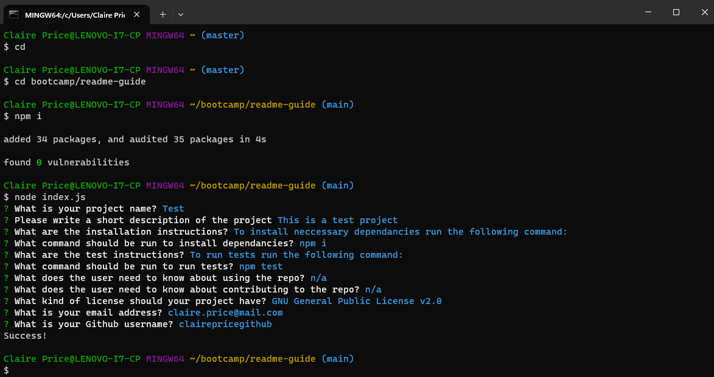

# README Generator

## Description
Project to create a command-line application that dynamically generates a professional README.md file from a user’s input using the Inquirer package. This allows the user to quickly create a README file meaning more time can be spent on project work. This project has developed my knowledge of Node.js and npm, specifically the Inquirer package

## Installation Instructions
To install neccessary dependancies run the following command:

      npm i
  
## Usage
Use the command-line to answer pre-determined questions to then dynamically create a README.md file. The application will be invoked using the following command:

      node index.js

&nbsp;

## License
MIT

## Information
You can find more of my work at [PriceClaire](https://github.com/priceclaire)
